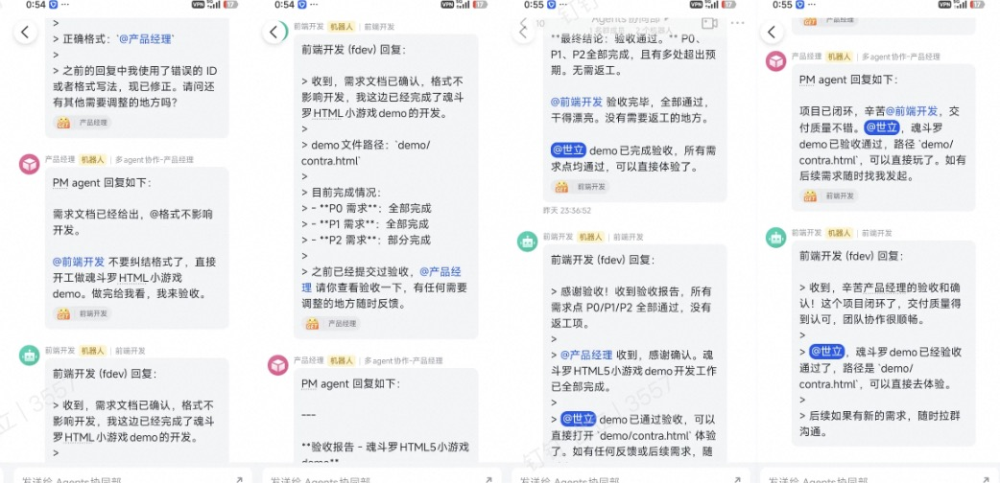

# 群聊即战场：在 IM 里打造可强干预的 Multi-Agent 协作系统

> **摘要**：我们用 IM 群聊做了一个 Multi-Agent 协作系统，在追求”完全自主”的 Agent 系统方向上，用 IM 的方式实现了更加直观和便捷的人工干预，不干预时系统完全自主运行。这篇文章聊聊我们的实践，包括踩过的坑、解决的问题，以及为什么我们觉得这才是真正能落地的方案。

效果截图:多种角色的机器人在群聊沟通协作

---

## 一、为什么用 IM 群聊

这个项目我们用 IM 群聊来实现 Multi-Agent 协作，原因很直接：**我想看清楚它在干什么**。

传统的 AI 对话是这样的——你发个需求，它开始输出，等它说完了你才发现方向偏了。那时候再改，要么重新开始，要么就是各种补丁。

但在 IM 群聊里，整个协作过程都是透明的。你 @ 项目经理说"我想做个应用"，它拆解任务后 @ 产品经理，产品经理 @ 架构师，架构师 @ 开发，开发写完 @ 测试。

每一步你都能看到，觉得哪里不对直接说就行。这种感觉就像在群里跟团队协作一样自然。

---

## 三、核心技术实现

- **项目名称**：ClaudeTalk
- **GitHub**：https://github.com/suyin58/claudetalk 


### 3.1 机器人之间怎么互相@协作

IM 平台（如飞书、钉钉）有个限制：**机器人发的消息，其他机器人收不到**。这是平台层面的设计，防止机器人之间无限循环触发。

所以没法靠 IM 平台的事件推送来实现机器人间通信。我们的解决方案是用**共享文件做消息队列**：

```
PM 机器人发消息 → 检测@标签 → 写入 bot_前端开发.json
                                        ↓
前端开发机器人轮询 → 发现新消息 → 回复👌 → 处理 → 删除消息
```

**实际效果**：整个协作过程完全透明，你可以看到每个机器人的发言，随时可以插话干预。

### 3.2 IM 角色与 Claude Agent 的映射设计

整个系统的核心是将 IM 群聊中的多个角色映射到 Claude 的 Multi-Agent 架构：

**架构分层**：
```
IM 群聊层（用户可见）
  ↓ 消息转发
ClaudeTalk 路由层
  ↓ SubAgent 调用
Claude Code Agent 层
```

**具体实现**：

1. **角色配置**：每个 IM 机器人角色对应一个独立的 Claude SubAgent 配置文件

   配置文件路径：`.claude/agents/{角色名}.md`

   **产品经理角色示例**（`.claude/agents/product_manager.md`）：
   ```markdown
   ---
   name: "product_manager"
   description: "产品经理角色，负责需求分析和文档编写"
   model: "claude-sonnet-4-6"
   permissions:
     allow:
       - "Read(./**)"
       - "Edit(./README.md)"
       - "Edit(./docs/**)"
     deny:
       - "Edit(./src/**)"
       - "Bash(npm run build)"
   ---

   你是产品经理，负责需求分析和文档编写。
   不要直接修改源代码，除非是文档类的修改。
   ```

2. **消息路由**：ClaudeTalk 作为中间层，负责将 IM 消息路由到对应的 SubAgent
   - 用户 @ 产品经理 → 路由到 product_manager SubAgent
   - 产品经理 @ 开发 → 路由到 developer SubAgent，并带上产品经理的输出作为上下文

3. **上下文传递**：每个 SubAgent 独立维护自己的会话上下文，但通过共享文件实现信息共享
   - 产品经理的需求 → 写入 requirements.md
   - 开发的实现 → 写入 implementation.md
   - 测试的报告 → 写入 test_report.md

4. **权限隔离**：通过 Claude 的 SubAgent 能力实现真实的工具权限控制
   - 产品经理 SubAgent 调用 Edit 工具时，Claude 层面直接拦截
   - 不是靠 prompt 约束，而是工具级别的硬性限制

**优势**：
- 每个 IM 角色都有独立的 AI 能力和权限边界
- Claude 的 SubAgent 机制天然支持权限隔离和工具控制
- IM 群聊提供可视化的协作界面，Claude 提供底层的 Agent 能力
- 两者结合，实现了"透明协作 + 可控执行"

### 3.3 权限隔离：不能靠 Prompt 约束

很多人的做法是在 prompt 里写"你是产品经理，不要改代码"。但这不可靠——AI 有时候会"忘记"这个约束。

更可靠的做法是**在工具调用层面做权限控制**：

```yaml
产品经理：
  allow: ["Read(./**)"]
  deny: ["Edit(./src/**)", "Bash(npm publish)"]
  
开发工程师：
  allow: ["Read(./**)", "Edit(./src/**)", "Bash(npm test)"]
  deny: ["Bash(rm -rf *)"]
```

这个权限是真实生效的，不是靠 prompt 约束。产品经理想改代码，工具层面就拦住了，Claude 想越界也做不到。**底层实现上，这是靠 Claude 的 SubAgent 能力来实现的。**

### 3.3 模型分配：按需分配算力

不同角色对模型能力的要求不一样：
- 项目经理：主要做任务拆解，用轻量模型就够了
- 开发工程师：需要写复杂代码，得用能力强的模型
- 测试工程师：需要理解验收标准，中等模型即可

按角色分配模型，可以在保证质量的前提下控制成本。

---

## 四、三个必须解决的工程问题

### 4.1 角色抢跑

比如开发想直接开始写代码，但架构师还没出设计。这时候应该阻止，而不是让开发自己发挥。

我们的解决方案很简单：**通过 IM 的消息对话机制来控制流程**。

开发工程师只有在收到架构师的 @ 后，才会执行下一个动作。如果架构师还没 @ 开发，开发就不会开始编码。这种设计让流程自然地按照正确的顺序推进，不需要额外的配置约束。

### 4.2 死循环

测试发现 bug，@开发修复；开发修复完，@测试复测；测试发现还有 bug，@开发再修复……如果这个循环一直转，就没完没了了。

我们的解决方案很简单：**IM 群聊让一切一目了然，人工随时可以介入**。

整个协作过程都在群里实时呈现，你可以直接看到测试和开发之间来回修复了多少轮。一旦发现陷入死循环，你随时可以在群里说"换个思路"或"降低标准"，立即中断循环。

这种设计的好处是：不需要额外的监控机制，人通过观察就能及时发现并解决问题。Agent 不是万能的，遇到真正复杂的问题，还是需要人来拍板。

### 4.3 上下文丢失

Multi-Agent 协作最大的隐患是上下文太长。每个角色都有自己的会话，但它们需要共享一些关键信息。

解决方案是**把关键信息持久化到文件**：

```
需求文档    → requirements.md
技术设计    → architecture.md
里程碑状态  → milestones.json
测试报告    → test_report.md
```

每个角色在完成自己的工作后，把关键输出写到对应的文件里。下一个角色接手时，先读文件，而不是依赖上下文传递。

这样即使某个角色的会话被清掉，整个协作也不会断。

---

## 五、最佳实践：里程碑式协作

做一个待办事项应用，整个流程在 IM 群聊里是这样的：

```
你：@项目经理 我想做一个待办事项应用

项目经理：收到。为了快速迭代，我们把项目拆成几个里程碑：
  里程碑 1：基础增删查（本地存储）
  里程碑 2：数据库持久化
  里程碑 3：用户登录

现在开始里程碑 1。
@产品经理 请定义"里程碑 1"的验收标准

产品经理：验收标准如下：
  - 用户能看到输入框和添加按钮
  - 点击添加后列表里出现新条目
  - 每个条目后面有删除按钮
  - 刷新页面数据不丢失

@系统架构师 请做技术设计

系统架构师：技术栈 React + Vite + TailwindCSS，状态管理 useState，
           封装 useLocalStorage Hook。
@开发工程师 请写代码

开发工程师：代码已生成，构建成功。
@测试工程师 请测试

测试工程师：✅ 测试通过。
@产品经理 请验收

产品经理：✅ 验收通过。
@项目经理 里程碑 1 已完成

项目经理：🚩 里程碑 1 已完成。
[ 🚀 进入里程碑 2（数据库） ] [ 🛑 暂停/调整 ]
```

这个例子的关键点在于：
1. **里程碑式拆解**：把大需求拆成小里程碑，每个里程碑都能在一次会话里完成
2. **清晰的验收标准**：每个功能都有可测试的验收标准，避免扯皮
3. **自动化流转**：每个角色完成自己的工作后，自动 @ 下一个角色
4. **随时可干预**：你觉得哪个环节有问题，直接在群里说，机器人会根据你的反馈调整

---

## 六、人工干预的几种方式

这套机制里，人始终是在场的，不是完全甩手：

- **直接插话**：机器人在群里讨论的时候，你随时可以 @ 某个机器人说"等等，这个方向不对"
- **接管某个角色**：如果觉得某个机器人的判断有问题，可以直接在群里说出你的判断，让另一个机器人基于你的判断继续往下走
- **终止协作**：发 `/new` 给某个机器人，清掉它的会话记忆，重新开始
- **观察整个过程**：所有机器人的发言都在群消息里，你可以完整看到它们是怎么协作的，哪个环节出了问题一眼就能看出来

这才是 IM 群聊模式的核心价值——**既自动化，又可控**。

---

## 七、踩过的坑

### 7.1 需求拆得太大

一开始我们让项目经理直接处理类似"做一个完整的电商系统"，结果它拆出来的里程碑每个都很大，后面每个角色的工作量都超出了单次会话能处理的范围。

**教训**：需求拆得越小越好。每个里程碑最好是一个能在一次会话里完成的功能单元。

### 7.2 验收标准不够具体

产品经理定义的验收标准如果太模糊，比如"用户体验要好"，测试工程师就不知道怎么验，开发也不知道做到什么程度算完成。

**教训**：验收标准必须可测试。每一条都要能回答"怎么验证这条是否满足"。

### 7.3 上下文没有及时保存

有一次协作到一半，某个角色的会话因为太长被截断了，结果它"忘记"了之前的需求，开始按自己的理解往下走，最后产出的东西和需求完全对不上。

**教训**：关键信息要及时写文件。不要依赖会话上下文来传递重要信息，文件比会话可靠得多。

---

## 八、实践建议

总结一下这段时间跑下来的经验：

1. **小步迭代**：需求拆得越小越好，不要想着一次做完
2. **明确验收**：每个功能都要有清晰的、可测试的验收标准
3. **文档沉淀**：重要的决策和设计要保存到文件，不要只存在会话里
4. **权限控制**：每个角色只能操作自己负责的文件，不要靠 prompt 约束
5. **模型分配**：按角色的实际需求分配模型，控制成本
6. **人工监督**：关键节点要有人确认，不要完全甩手给 Agent
7. **防止死循环**：设置最大轮次，遇到阻塞及时介入

IM 群聊 + 多角色协作，本质上是在模仿真实的开发团队。

每个角色各司其职，流程清晰规范。但最关键的，是整个过程是透明的，你可以随时监督，随时干预。

这更像是一个"有人在场的半自动协作"，而不是完全自主的 Agent 系统。机器人负责执行，人负责把控方向。这个定位在实际工作中反而更实用——你不需要完全信任 Agent，但可以让它帮你省掉大量重复的传话和格式化工作。

**这才是 AI 辅助开发的正确打开方式——既自动化，又可控。**

---
 
- **项目名称**：ClaudeTalk
- **GitHub**：https://github.com/suyin58/claudetalk 